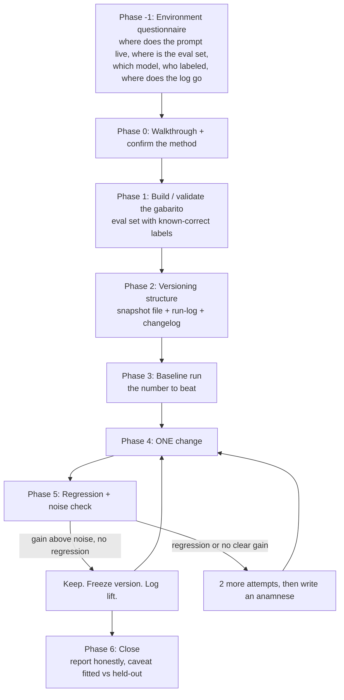

# prompt-iteration-playbook

A portable, disciplined loop for making an LLM prompt measurably better, instead of guessing.

It works the same whether your prompt lives in **Claude Code**, a **Clay AI column**, the **OpenAI Playground or API**, an **n8n / Zapier / Make** node, or some **custom tool this playbook has never seen**. The method is constant; only the mechanics adapt to your environment.

You can use it two ways:

- **As a Claude Code skill** (`SKILL.md`): drop the folder into your skills directory and the agent runs the loop with you.
- **As a human playbook**: read it and run the loop yourself, in any tool. Nothing here depends on a specific vendor.

---

## Quickstart

### Install (as a Claude Code skill)

```bash
git clone https://github.com/manuelfaustls/prompt-iteration-playbook.git
cp -r prompt-iteration-playbook ~/.claude/skills/optimize-prompt-portable
```

Reload Claude Code and you are set. (If you do not already have a skill named `optimize-prompt`, you can name the folder `optimize-prompt` instead, for a shorter trigger.)

### Use it

Say what you want, in English or Spanish:

> help me improve this classifier prompt, I have about 30 labeled examples

or invoke it explicitly with `/optimize-prompt-portable`.

It asks five quick questions about your setup (where the prompt lives, where your eval set is, which model, who labeled it, where to log the runs), confirms what it understood, then walks you through one measured change at a time. To skip the questions, declare the setup up front:

```
/optimize-prompt-portable env=clay model=gpt-4o-mini eval=clay-table labeler=human
```

### Not using Claude Code?

Iterating a prompt in Clay, ChatGPT, or a notebook? Open [`SKILL.md`](SKILL.md) and follow the phases yourself; it is written to be run by a person, and [`references/environments/`](references/environments/) has the mechanics for your tool.

---

## The one idea

**Every change to a prompt is a hypothesis. The eval set is how you try to falsify it.**

You change one thing, run the prompt over a set of inputs whose correct answers you already know (a "gabarito"), and measure whether accuracy actually moved, above the noise. If it did, you keep it; if it did not, you learn why. A change you cannot measure is not an improvement. It is a guess that happens to feel right.

That is the whole discipline. The rest is the scaffolding that keeps you honest: version every prompt, log every run, change one thing at a time, scan for regressions, and never tune to answers a human never checked.

---

## Methodology

The loop is built to stop you from fooling yourself. Four principles run through every phase:

| Principle | What it means in practice |
|---|---|
| **Isolation** | One change per run. Two changes at once and you cannot attribute the result to either. |
| **Measurement** | Score against known-correct labels, on the rows that are decidable from the input alone. No number without its caveats. |
| **Falseability** | A change must be testable against the eval set. If it cannot be falsified, it is a hypothesis, not a win. |
| **Honest inference** | State what a result lets you conclude and what it does not: fitted vs held-out, sample size, the noise floor. |

If you internalize one thing: a prompt loop is only as trustworthy as the eval set it is measured against. Build that first. See [the gabarito guide](references/02-the-gabarito.md).

---

## The flow



Read the phases in detail in [`SKILL.md`](SKILL.md). The short version:

- **Phase -1, Environment questionnaire.** Five questions, answered before anything else, because the mechanics (and the cost) of a run depend entirely on where the prompt lives. The playbook never assumes it knows your tool. See [the questionnaire](references/01-environment-questionnaire.md).
- **Phase 0, Walkthrough.** The playbook offers to explain how the loop works and waits for you to confirm the method. A shared understanding prevents the three classic misuses (changing many things at once, tuning to unreviewed labels, reading noise as signal).
- **Phase 1, The gabarito.** Build or validate the eval set: inputs with known-correct labels, marked `clean` / `needs_context` / `out_of_scope`. You score on `clean` rows only. This is the foundation. See [the gabarito guide](references/02-the-gabarito.md).
- **Phase 2, Versioning.** Three durable artifacts: a frozen snapshot per prompt version, a run-log CSV, and a changelog. By default these are plain local files, so they survive losing access to any tool.
- **Phase 3, Baseline.** Run the current version. Log it. This is the number to beat.
- **Phase 4, One change.** Exactly one. Prefer a deterministic check over an LLM judgment wherever the task allows.
- **Phase 5, Regression + noise.** Which correct rows just broke? Is the delta bigger than the noise floor (measured, not assumed)? A regression or a flat result triggers the [anamnese protocol](references/04-anamnese-protocol.md).
- **Phase 6, Close.** Freeze the version, log the lift, and report the number with its caveats.

---

## The gabarito (read this before you measure anything)

The eval set, the "gabarito", is the part people skip and the part that decides whether any of your numbers mean anything. It needs four columns at minimum:

| Column | What it is for | How to fill it |
|---|---|---|
| `input` | The exact input the prompt sees | Copy the real input, one per row |
| `expected_label` | The known-correct answer | The ground truth; leave blank for `needs_context` rows |
| `labeler` | Who decided the correct answer | `human:<name>` (truth) or `ai:<model>` (provisional, never tune to it) |
| `categoria` | What kind of row this is | `clean`, `needs_context`, or `out_of_scope` (see below) |

- **`clean`**: the input alone is enough to decide. You score accuracy on these rows only.
- **`needs_context`**: the input is genuinely insufficient. This marks the ceiling of what any prompt could get right, not a miss.
- **`out_of_scope`**: the row should not be in the set (wrong format, duplicate). Remove it.

Any accuracy number you show someone needs at least **20 clean, human-labeled rows**. A three-point move on 20 rows is inside the noise. Full column-by-column guide, scenarios, and how to build a set from scratch: [`references/02-the-gabarito.md`](references/02-the-gabarito.md). Ready-to-copy templates: [`examples/`](examples/).

---

## Environments

The loop is identical everywhere. What changes is how you snapshot a version, how you run the eval, and what a run costs. Read the file for your environment; if yours is not listed, use `generic.md`, which gives the minimal contract and the questions to ask.

| Environment | Prompt versioning | Running an eval | Cost of a run | Guide |
|---|---|---|---|---|
| **Claude Code / your own code** | however you version code (git, or a dated .md) | a script over the eval CSV | LLM tokens only | uses the generic contract |
| **Clay** | classic "Use AI" column: none (snapshot to a local .md/.csv); Claygent builder: native | run a row slice; score with a free Formula column | credits per row, every re-run | [`clay.md`](references/environments/clay.md) |
| **OpenAI** | dashboard Prompts: native (pin the version); API strings: none | Playground by hand, or the Evals product | tokens per run | [`openai.md`](references/environments/openai.md) |
| **n8n / Zapier / Make** | versions the whole workflow, retention expires; snapshot to a local .md | n8n has a built-in eval; Zapier/Make are manual | n8n self-host free; Zapier/Make metered | [`automation-tools.md`](references/environments/automation-tools.md) |
| **Anything else** | snapshot to a local .md the moment you can read the text | whatever the tool allows; ask first | ask before any batch | [`generic.md`](references/environments/generic.md) |

The recurring lesson across all of them: **keep the source of truth outside the tool.** A local snapshot file and a local run-log CSV cost nothing, diff cleanly, and outlive any vendor's history feature.

---

## Not fooling yourself

A short version of [`references/03-inference-falseability-risk.md`](references/03-inference-falseability-risk.md):

- **Inference.** "v3 scores 94% (30/32) on clean human-labeled rows, fitted, above the noise floor but inside a wide CI at n=32, so suggestive not proven" is honest. "v3 is 94% accurate" is not. A gain must clear two gates: the re-run noise floor and the sampling interval.
- **Falseability.** If a change cannot be tested against the eval set, it is a hypothesis. Build the test or label it as one.
- **Risks.** Overfitting to the eval; tuning to unreviewed labels (circular); noise read as signal; silent model/context drift; runaway cost in metered tools.
- **Opportunities.** Replace a fragile LLM judgment with a deterministic check; split a fused prompt into a frozen part and an iterated part; turn a recurring failure into a reusable example-anchor.

---

## Repo map

```
prompt-iteration-playbook/
├── README.md            you are here: methodology, overview, flow
├── SKILL.md             the Claude Code skill (also readable as the operating manual)
├── examples/            a complete worked example, copy-ready
│   ├── classifier-prompt_v1.0.md     a baseline prompt
│   ├── classifier-prompt_v1.1.md     the same prompt, one change, with the reasoning
│   ├── eval-set-template.csv         a gabarito showing all three categorias
│   └── run-log-template.csv          a run-log showing the baseline and the lift
└── references/
    ├── 00-how-it-works.md            the plain-language walkthrough
    ├── 01-environment-questionnaire.md
    ├── 02-the-gabarito.md            the eval set, in depth
    ├── 03-inference-falseability-risk.md
    ├── 04-anamnese-protocol.md
    ├── 05-the-run-log.md             the run-log, column by column
    └── environments/
        ├── clay.md
        ├── openai.md
        ├── automation-tools.md
        └── generic.md
```

---

## Provenance and contributing

This playbook generalizes a loop proven on real classifier and qualification prompts that moved from mediocre to near-perfect accuracy on their clean eval sets over a handful of measured, logged iterations (sample sizes in the dozens; the numbers were fitted to the eval rows and caveated as such, per the rules this repo preaches). The environment-specific guidance was researched against vendor docs current as of May 2026; where a mechanic could not be verified, the relevant file says so and tells the playbook to ask the user instead of assuming.

Improvements happen through forks and pull requests, and they stay general and vendor-agnostic: a new environment, a corrected mechanic, a method lesson. Method lessons live in [`references/04-anamnese-protocol.md`](references/04-anamnese-protocol.md). Please do not bake a specific prompt, dataset, or company into the skill: per-case learnings belong in your own run-log and notes, not in here. If you are adapting the skill to your own situation, fork it; do not edit your installed copy in place during a task.

*As of 2026-05-29.*
